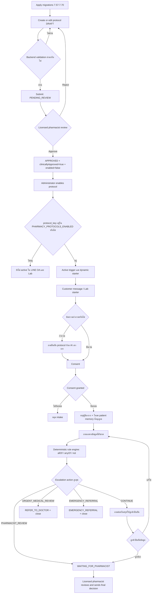

# Pharmacy Protocol Workflow and QA Test Cases

เอกสารนี้ใช้ทดสอบระบบ Pharmacy Intake ทั้ง LINE OA, Pharmacy Intake Lab,
Protocol authoring, compound conditions, escalation และ pharmacist queue แบบ end-to-end

> Safety: ใช้ข้อมูลจำลองและ LINE OA sandbox เท่านั้น กฎตัวอย่างในเอกสารเป็น **QA draft**
> ไม่ใช่คำแนะนำทางคลินิก และห้ามเปิด production จนกว่าจะผ่านการตรวจโดยเภสัชกรที่มีใบอนุญาต

## 1. ขอบเขตที่ต้องผ่านก่อนเปิดใช้

- Migration `7.57` ถึง `7.70` ถูก apply ตามลำดับ และ rerun ได้โดยไม่ error
- ร้านทดสอบมี archetype เป็น pharmacy และเปิด `PHARMACY_INTAKE_ENABLED=true`
- ถ้าทดสอบ AI extraction ให้เปิด `PHARMACY_AI_ENABLED=true` และตั้ง provider/key สำหรับ sandbox
- `PHARMACY_PROTOCOLS_ENABLED` มี `protocol_key` ที่ต้องการทดสอบ เช่น `fever`
- มี Administrator, ผู้ใช้ทั่วไป และเภสัชกรทดสอบที่มี `is_licensed_pharmacist=true`
- LINE OA sandbox เชื่อมกับ tenant ทดสอบ หรือใช้ Pharmacy Intake Lab สำหรับ smoke test
- ห้ามใช้ข้อมูลผู้ป่วยจริง และห้ามแก้สถานะ clinical approval ด้วย SQL โดยตรง

## 2. Workflow ของระบบ



### Protocol lifecycle

| จาก | Action | ไป | เงื่อนไขสำคัญ |
| --- | --- | --- | --- |
| ไม่มี/DRAFT | Save | DRAFT | ผ่าน JSON และ field-reference validation |
| DRAFT | Submit for review | PENDING_REVIEW | Protocol สมบูรณ์ |
| PENDING_REVIEW | Reject | DRAFT | เภสัชกรมีใบอนุญาตเท่านั้น |
| PENDING_REVIEW | Approve | APPROVED | ตั้ง `clinicallyApproved=true` แต่ยัง `enabled=false` |
| APPROVED | Enable | APPROVED + enabled | ต้อง clinical approved และ trigger ไม่ชน protocol อื่น |
| Enabled | Disable | APPROVED + disabled | หยุด trigger/starter ทันที |

Runtime จะเห็น protocol ก็ต่อเมื่อครบทั้งสี่เงื่อนไข:

```text
status=APPROVED
AND clinically_approved=true
AND enabled=true
AND protocol_key อยู่ใน PHARMACY_PROTOCOLS_ENABLED
```

### Escalation mapping เริ่มต้น

| Severity | Default action | Assessment status | ส่งข้อความลูกค้า |
| --- | --- | --- | --- |
| LOW | CONTINUE | คง flow เดิม | ไม่มีข้อความ escalation |
| MODERATE | PHARMACIST_REVIEW | WAITING_FOR_PHARMACIST | ข้อความให้เภสัชกรตรวจ |
| HIGH | URGENT_MEDICAL_REVIEW | REFER_TO_DOCTOR | ข้อความเร่งด่วนแบบคงที่ 1 ครั้ง |
| EMERGENCY | EMERGENCY_REFERRAL | EMERGENCY_REFERRAL | ข้อความฉุกเฉินแบบคงที่ 1 ครั้ง |

`escalationRules.bySeverity` เปลี่ยน mapping ได้ แต่ engine เป็นผู้ตัดสินจากข้อมูลโครงสร้าง
AI ไม่มีสิทธิ์เลือก severity/action เอง และเมื่อหลายกฎตรงพร้อมกันต้องเลือก action ที่รุนแรงที่สุด

## 3. QA-only protocol สำหรับทดสอบ compound rules

สร้างผ่าน `/admin/pharmacy-protocols` โดยใช้ค่าต่อไปนี้ แล้วให้เภสัชกรตรวจเนื้อหาจริงก่อน approve:

```json
{
  "protocolKey": "fever",
  "name": "Fever compound-condition QA draft",
  "version": 1,
  "supportedSymptomGroup": "fever",
  "displayLabel": "ไข้",
  "triggerTerms": ["ไข้", "ตัวร้อน", "fever"],
  "requiredFields": [
    {"key":"fever_temp","label":"อุณหภูมิที่วัดได้","type":"number","questionKey":"q_fever_temp"},
    {"key":"duration_days","label":"มีอาการมากี่วัน","type":"number","questionKey":"q_fever_duration"},
    {"key":"breathing_difficulty","label":"หายใจลำบากหรือไม่","type":"yes_no","questionKey":"q_fever_breathing"},
    {"key":"seizure","label":"มีอาการชักหรือไม่","type":"yes_no","questionKey":"q_fever_seizure"},
    {"key":"neck_stiffness","label":"มีอาการคอแข็งหรือไม่","type":"yes_no","questionKey":"q_fever_neck"}
  ],
  "conditionalQuestions": [],
  "redFlagRules": [
    {
      "code":"QA_RF_YOUNG_HIGH_TEMP",
      "label":"ผู้ป่วยอายุน้อยร่วมกับอุณหภูมิสูง (กฎ QA เท่านั้น)",
      "severity":"EMERGENCY",
      "condition":{"allOf":[
        {"field":"patient_age_years","lessThan":1},
        {"field":"fever_temp","greaterThanOrEqual":38}
      ]}
    },
    {
      "code":"QA_RF_EMERGENCY_SYMPTOM",
      "label":"พบอาการฉุกเฉินอย่างน้อยหนึ่งข้อ (กฎ QA เท่านั้น)",
      "severity":"EMERGENCY",
      "condition":{"anyOf":[
        {"field":"breathing_difficulty","equals":"YES"},
        {"field":"seizure","equals":"YES"}
      ]}
    },
    {
      "code":"QA_RF_HIGH_TEMP",
      "label":"อุณหภูมิสูง (กฎ QA เท่านั้น)",
      "severity":"HIGH",
      "condition":{"field":"fever_temp","greaterThanOrEqual":40}
    },
    {
      "code":"QA_RF_PERSISTENT",
      "label":"อาการต่อเนื่องและไม่มีคอแข็ง (กฎ QA เท่านั้น)",
      "severity":"MODERATE",
      "condition":{"allOf":[
        {"field":"duration_days","greaterThan":5},
        {"not":{"field":"neck_stiffness","equals":"YES"}}
      ]}
    }
  ],
  "completionRules":{"requireAllOf":["fever_temp","duration_days","breathing_difficulty","seizure","neck_stiffness"]},
  "escalationRules":{"bySeverity":{
    "LOW":"CONTINUE",
    "MODERATE":"PHARMACIST_REVIEW",
    "HIGH":"URGENT_MEDICAL_REVIEW",
    "EMERGENCY":"EMERGENCY_REFERRAL"
  },"onUnresolvedConflict":"WAITING_FOR_PHARMACIST"}
}
```

## 4. Test cases

บันทึกหลักฐานอย่างน้อย: environment, tenant, protocol id/version, assessment id,
ข้อความเข้า/ออก (ปิดข้อมูลส่วนบุคคล), expected/actual status, event action, ผู้ทดสอบ และเวลา

### A. Migration และ schema

| ID | วิธีทดสอบ | Expected result |
| --- | --- | --- |
| MIG-01 | Apply `7.69` บน DB ที่มี `bms_pharmacy_assessments` แต่ขาดคอลัมน์จาก `7.65/7.66/7.68` | Migration สำเร็จและสร้างคอลัมน์ที่ขาดครบ |
| MIG-02 | Apply `7.69` และ `7.70` ซ้ำ | สำเร็จ ไม่มี duplicate-column/constraint error |
| MIG-03 | ตั้ง relationship เป็น `SELF` ผ่าน application แล้ว rerun `7.69` | ค่า explicit `SELF` ไม่ถูก reset เป็น `UNKNOWN` |
| MIG-04 | ตรวจ 3 seed protocols หลัง `7.70` | มี `display_label` และ `trigger_terms` แต่ไม่ถูก enable อัตโนมัติ |
| MIG-05 | พยายามทำ enabled protocol ที่ status ไม่ใช่ APPROVED ใน transaction ทดสอบแล้ว rollback | DB constraint ปฏิเสธ |

### B. Protocol validation และ approval workflow

| ID | วิธีทดสอบ | Expected result |
| --- | --- | --- |
| PRO-01 | Save QA JSON ด้านบน | ได้ DRAFT และ JSON ทุกส่วนถูกเก็บ |
| PRO-02 | ใช้ protocol key มีช่องว่าง/อักขระไม่รองรับ | Backend ตอบ BAD_USER_INPUT |
| PRO-03 | ใส่ condition อ้าง field ที่ไม่ได้ประกาศ | Validation ปฏิเสธและบอก field |
| PRO-04 | ใส่ required field key ซ้ำ | Validation ปฏิเสธ |
| PRO-05 | Leaf เดียวมีทั้ง `equals` และ `greaterThan` | Validation ปฏิเสธ เพราะต้องมี operator เดียว |
| PRO-06 | `in` เป็น array ว่างหรือเกิน 50 ค่า | Validation ปฏิเสธ |
| PRO-07 | สร้าง condition ลึกเกิน 5 ชั้น หรือรวมเกิน 100 clauses | Validation ปฏิเสธ |
| PRO-08 | `allOf`/`anyOf` ไม่มี child | Validation ปฏิเสธ |
| PRO-09 | ส่ง DRAFT ที่ถูกต้องให้ review | เปลี่ยนเป็น PENDING_REVIEW |
| PRO-10 | แก้ protocol ขณะ PENDING_REVIEW | ปฏิเสธ; ต้อง Reject กลับ DRAFT ก่อน |
| PRO-11 | ผู้ใช้ที่ไม่มี pharmacist license กด Approve | ปฏิเสธและสถานะไม่เปลี่ยน |
| PRO-12 | Licensed pharmacist กด Reject | กลับ DRAFT, clinical=false, enabled=false |
| PRO-13 | Licensed pharmacist กด Approve | APPROVED, clinical=true, reviewedBy/At มีค่า, enabled ยัง false |
| PRO-14 | พยายาม enable DRAFT/PENDING_REVIEW | Backend/DB ปฏิเสธ |
| PRO-15 | protocol อื่นใช้ trigger term เดียวกันและถูก enable | ปฏิเสธ collision ระหว่าง protocol key |
| PRO-16 | Approve+enable แต่ไม่อยู่ใน env allowlist | `platformAllowed=false`; ไม่ขึ้น Lab และไม่ trigger LINE |
| PRO-17 | เพิ่ม key ใน allowlist แล้ว restart service | `platformAllowed=true`; starter/trigger พร้อมใช้ |
| PRO-18 | Disable protocol ที่ active | หายจาก Lab และข้อความใหม่ไม่เริ่ม protocol นี้ |

### C. Dynamic trigger: LINE OA และ Lab

| ID | Input/ขั้นตอน | Expected result |
| --- | --- | --- |
| TRG-01 | `มีไข้ไหม` | ระบบมองว่ากำกวมและถามกลับว่าเป็นอาการของผู้ป่วยหรือถามหาสินค้า ห้ามเดาเอง |
| TRG-02 | ยืนยันว่า `ผู้ป่วยมีไข้` | เข้า consent ของ fever protocol |
| TRG-03 | `มีไข้สูงมาก วัดได้ 40 องศา` | เข้า clinical intake; หลังเก็บข้อมูลพอแล้ว rule engine ประเมิน HIGH/สูงกว่า |
| TRG-04 | `มียาแก้ไข้ไหม` | ระบบเข้า pharmacy-safe clarification/intake ไม่ตอบชื่อยาหรือวินิจฉัยเอง |
| TRG-05 | ข้อความไม่ตรง trigger ใด | ไม่สร้าง pharmacy assessment |
| TRG-06 | กด starter `ไข้` ใน Lab | เริ่ม protocol เดียวกับ LINE และแสดง label จาก DB |
| TRG-07 | แก้ `displayLabel`/`triggerTerms` เป็น Draft version ใหม่ | ของเดิมยัง active จน version ใหม่ approve+enable |
| TRG-08 | ส่งข้อความฉุกเฉินที่ตัวตรวจจับฉุกเฉินรู้จัก | ข้อความฉุกเฉินคงที่ทันที ไม่รอ AI และไม่ถามคำถามทั่วไปต่อ |

### D. Consent, identity และ patient memory

| ID | วิธีทดสอบ | Expected result |
| --- | --- | --- |
| IDN-01 | ยังไม่ยินยอมแล้วส่งข้อมูลสุขภาพต่อ | ระบบยังไม่บันทึก intake fields จน consent granted |
| IDN-02 | ตอบ `ไม่ยินยอม` | หยุด intake อย่างสุภาพ ไม่มีเคสไหลเข้า queue |
| IDN-03 | ตอบ `ยินยอม` | ถามก่อนว่าผู้มีอาการคือใคร (`SELF/CHILD/PARENT/OTHER`) |
| IDN-04 | ลูกค้าเดิม + SELF + มีอายุ/เพศ/แพ้ยาที่เชื่อถือได้ | ระบบเติม memory และไม่ถามข้อมูลเดิมซ้ำ |
| IDN-05 | ลูกค้าเดิมแต่ตอบ CHILD | ไม่ใช้ข้อมูลสุขภาพของ SELF แทนเด็ก |
| IDN-06 | ข้อมูลในข้อความล่าสุดขัดกับ memory | ใช้ข้อมูลล่าสุดเป็น candidate/ขอ confirm; ไม่ overwrite แบบเงียบ ๆ |
| IDN-07 | ส่งจาก LINE, Shopee, IG ที่ยังไม่ link identity | แยก channel identity; ห้ามรวมคนจากชื่อเหมือนกันเอง |
| IDN-08 | identity ถูก link อย่างมีหลักฐานใน CRM | ใช้ stable memory/ที่อยู่ตาม policy แต่ยังไม่ส่ง raw PII เข้า AI prompt โดยไม่จำเป็น |

### E. Compound conditions และ escalation

| ID | Structured answers สำคัญ | Expected result |
| --- | --- | --- |
| CMP-01 | age=0, temp=38 | `allOf` true → EMERGENCY_REFERRAL |
| CMP-02 | age=20, temp=38 | `allOf` false → ไม่เข้า `QA_RF_YOUNG_HIGH_TEMP` |
| CMP-03 | breathing=YES, seizure=NO | `anyOf` true → EMERGENCY_REFERRAL |
| CMP-04 | duration=6, neck=NO | `allOf` + `not` true → PHARMACIST_REVIEW/WAITING_FOR_PHARMACIST |
| CMP-05 | duration=6, neck=YES | `not` false; กฎ persistent ไม่ทำงาน |
| CMP-06 | temp=40 และ breathing=YES พร้อมกัน | เลือก EMERGENCY เหนือ HIGH เสมอ ไม่ขึ้นกับลำดับ JSON |
| CMP-07 | temp เป็น string ที่ parse ไม่สำเร็จ | ไม่ใช้ numeric operator; ถามแก้ข้อมูล/anomaly ห้ามเดา |
| CMP-08 | ค่า field ไม่มีอยู่และใช้ `exists:false` ใน draft ทดสอบ | condition ตรงเฉพาะเมื่อ field ไม่มี/ว่างจริง |
| ESC-01 | LOW rule ตรง | CONTINUE; ยังถาม field ที่ขาด ไม่มี escalation event |
| ESC-02 | MODERATE rule ตรง | WAITING_FOR_PHARMACIST + `assessment.protocol_pharmacist_review` |
| ESC-03 | HIGH rule ตรง | REFER_TO_DOCTOR + closed_at + urgent event |
| ESC-04 | EMERGENCY rule ตรง | EMERGENCY_REFERRAL + risk EMERGENCY + emergency event |
| ESC-05 | LINE ทำให้ HIGH/EMERGENCY ตรง | ลูกค้าได้รับข้อความ escalation เพียง 1 ข้อความ ไม่ซ้ำจาก service และ webhook |
| ESC-06 | เภสัชกรกรอก manual answer แล้ว rule ตรง | ใช้ engine เดียวกันและส่ง notification จาก admin path 1 ครั้ง |
| ESC-07 | Legacy protocol มี `onRedFlag=EMERGENCY_REFERRAL` | รักษาพฤติกรรมเดิม: matched severity ใดก็ emergency |

### F. Intake completion, confirmation และ pharmacist queue

| ID | วิธีทดสอบ | Expected result |
| --- | --- | --- |
| FLW-01 | ตอบข้อมูลไม่ครบ | status COLLECTING_INFORMATION, missingFields ถูกต้อง, ถามเพียงคำถามถัดไป |
| FLW-02 | ตอบค่าผิดรูปแบบ เช่นอายุ/อุณหภูมิเกินขอบเขต | สร้าง anomaly และถามยืนยันใหม่ |
| FLW-03 | ข้อมูลขัดกัน | completeness=CONFLICT และส่งให้เภสัชกร/ถามแก้ตาม rule |
| FLW-04 | ตอบครบและไม่มี red flag | PENDING_CONFIRMATION พร้อม summary แบบโครงสร้าง |
| FLW-05 | ลูกค้าตอบ `ข้อมูลถูกต้อง` | WAITING_FOR_PHARMACIST และปรากฏใน queue |
| FLW-06 | ลูกค้าขอแก้ไข | กลับไปเก็บข้อมูลเฉพาะ field ที่แก้ ไม่สร้างเคสซ้ำ |
| FLW-07 | refresh/retry webhook message เดิม | active assessment ไม่ซ้ำและไม่ส่ง decision ซ้ำ |
| FLW-08 | เปิด `/admin/pharmacy-queue/[quote-id]` | Summary แก้/save ได้, conversation แสดงชุดเดียว, Audit Timeline scroll ได้ |
| FLW-09 | ผู้ใช้ไม่มี license พยายาม approve case | ปฏิเสธ |
| FLW-10 | Licensed pharmacist approve พร้อม customer message | บันทึก decision/event/audit และส่งข้อความที่ตรวจแล้ว 1 ครั้ง |
| FLW-11 | Lab transcript มี relationship=SELF แล้วส่งเข้า queue | Snapshot เป็น SELF และ `missingFields` ไม่มี patient_relationship |
| FLW-12 | Lab transcript ไม่มี relationship | Snapshot เป็น UNKNOWN และ `missingFields` มี patient_relationship; ห้าม invent SELF |
| FLW-13 | เภสัชกรเลือก relationship จาก manual dropdown | เก็บ enum SELF/CHILD/PARENT/OTHER, re-run rule engine และมี `assessment.manual_answer_recorded` |
| FLW-14 | เรียก manual mutation ด้วย field ที่ไม่ได้ขาดหรือ relationship ไม่ถูกต้อง | Backend ปฏิเสธ แม้ bypass UI |
| FLW-15 | missing ว่างแต่ completeness ไม่ COMPLETE หรือมี conflict/anomaly | ทั้ง UI และ backend ไม่อนุญาต Approve |
| FLW-16 | ลูกค้ายังไม่ confirm และไม่มี manual event | Approve ถูกปฏิเสธ; เมื่อ manual entry สำเร็จและข้อมูล COMPLETE จึงใช้ audited override ได้ |
| FLW-17 | ยืนยันข้อมูลสำเร็จใน Pharmacy Intake Lab | สร้าง queue row ก่อน แล้วแสดง assessment ID จริงในข้อความโดยไม่ redirect |
| FLW-18 | เลือกสินค้า `DIRECT_SALE` ใน Lab | แสดงราคาต่อชิ้น จำนวน ยอดย่อย และยอดรวมจาก Catalog พร้อมปุ่มเพิ่มสินค้า/ดูตะกร้า/ยืนยันตะกร้า |
| FLW-19 | เพิ่มสินค้า 5 SKU แล้วกดยืนยันตะกร้า | เก็บครบ 5 รายการใน session และตรวจราคา สต็อก จำนวนสูงสุด และ Product Policy ของทุกรายการซ้ำก่อนผ่านไป Checkout ทดลอง |
| FLW-20 | ราคา/สต็อก/Policy เปลี่ยนก่อนยืนยันตะกร้า | ใช้ค่าปัจจุบันจาก backend; ถ้าขายไม่ได้หรือจำนวนเกินให้หยุดและแจ้งรายการที่มีปัญหา โดยไม่สร้าง queue ผิดประเภท |
| FLW-21 | สร้าง queue row สำเร็จ | session รีเซ็ตเป็น NONE อัตโนมัติ แต่ transcript และปุ่มเปิดเคสล่าสุดยังอยู่ |
| FLW-22 | queue mutation ล้มหลังยืนยัน | ไม่รีเซ็ต session; แสดง Retry และ retry แล้วพยายามสร้างเคสใหม่ได้ |

### G. Security, tenancy และ audit

| ID | วิธีทดสอบ | Expected result |
| --- | --- | --- |
| SEC-01 | tenant A ใช้ protocol/assessment id ของ tenant B ผ่าน GraphQL | ไม่พบข้อมูลหรือถูกปฏิเสธ |
| SEC-02 | ผู้ไม่มี `pharmacy.protocol.manage` เรียก mutation | ถูกปฏิเสธก่อน service mutation |
| SEC-03 | ตรวจ assessment event meta และ audit meta | ไม่มี raw conversation, medical_info, complaint, summary หรือ PII |
| SEC-04 | ส่ง JSON field/operator แปลกปลอม | boundary validation ปฏิเสธ; ไม่มี SQL/model-generated rule execution |
| SEC-05 | AI ตอบว่าเป็น emergency แต่ structured rule ไม่ตรง | AI ไม่มีสิทธิ์เปลี่ยน state; deterministic engine เท่านั้นที่ escalate |
| SEC-06 | ปิด `PHARMACY_INTAKE_ENABLED` | LINE/Lab ไม่เริ่ม intake และไม่มี assessment ใหม่ |

## 5. Read-only verification queries

รันด้วย role/context ของ tenant ทดสอบเท่านั้น และแทน placeholder ด้วย UUID ที่ถูกต้อง:

```sql
-- Protocol lifecycle และ activation state
SELECT id, protocol_key, version, status, clinically_approved, enabled,
       display_label, trigger_terms, reviewed_by, reviewed_at
FROM bms_pharmacy_protocols
WHERE tenant_id = '<tenant-id>'::uuid
ORDER BY protocol_key, version DESC;

-- Assessment outcome โดยไม่ดึง raw health payload
SELECT id, protocol_id, status, risk_level, completeness_status,
       patient_relationship, consent_status, missing_fields,
       conflicting_fields, created_at, closed_at
FROM bms_pharmacy_assessments
WHERE tenant_id = '<tenant-id>'::uuid
  AND id = '<assessment-id>'::uuid;

-- State/event trail; meta ต้องเป็นข้อมูลที่ลดรูปแล้ว
SELECT action, previous_state, next_state, meta, created_at
FROM bms_pharmacy_assessment_events
WHERE tenant_id = '<tenant-id>'::uuid
  AND assessment_id = '<assessment-id>'::uuid
ORDER BY created_at;
```

ตรวจจำนวน outgoing message จากหน้า conversation/ระบบข้อความโดยใช้ `conversation_id` และ tenant scope;
สำหรับ `ESC-05` ต้องมี escalation reply ใหม่เพียงหนึ่งรายการ ห้าม query/export เนื้อหาของลูกค้าจริงมาแนบหลักฐาน

## 6. ลำดับการรันที่แนะนำ

1. **Schema smoke:** MIG-01 ถึง MIG-05
2. **Safety gate:** PRO-01 ถึง PRO-18 และ SEC-01 ถึง SEC-06
3. **Engine unit/integration:** CMP-01 ถึง ESC-07
4. **Lab smoke:** TRG-01 ถึง TRG-08, IDN และ FLW ทั้งหมด
5. **LINE OA sandbox:** รัน TRG, IDN, ESC-05, FLW-05 ถึง FLW-10 ซ้ำบน webhook จริง
6. **Regression:** ทดสอบ headache, cough, diarrhea เดิมอย่างละ 1 normal + 1 red-flag case

## 7. เกณฑ์ผ่านก่อน production

- Migration apply และ rerun ผ่านทั้งหมด
- ไม่มีทาง enable protocol ที่ยังไม่ clinically approved
- กฎ compound ให้ผลเหมือนกันใน Lab, LINE และ manual pharmacist entry
- Severity สูงสุดชนะเมื่อหลายกฎตรงพร้อมกัน
- ข้อความ urgent/emergency ถูกส่งครั้งเดียวและไม่ผ่าน AI-generated prose
- ลูกค้าเดิมไม่ถูกถาม stable memory ซ้ำ แต่ข้อมูลคนละ patient relationship ไม่ปะปน
- ทุก mutation tenant-scoped, permission-gated และมี audit/event ที่ไม่เก็บ raw health data
- Licensed pharmacist ลงชื่อรับรอง protocol และ QA sign-off ครบก่อนเพิ่ม key ใน production allowlist
